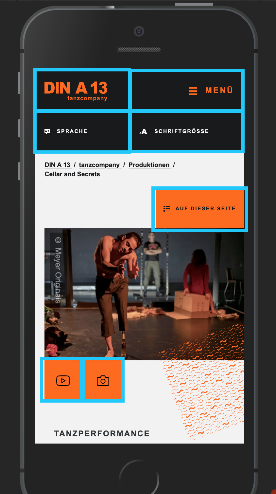

# Barrierefreiheit – DIN A 13 Website

Hinweis:
Dies ist Test-Version der zukünftigen DIN A 13 Website.
Die Seite dient zu Demozwecken, der Funktionalitäten bzgl. der Barrierefreiheit. Die Inhalte besitzen keinen Anspruch auf Vollständig- oder Richtigkeit. Inhalte auf englischer Sprache sind nicht oder nur teilweise angelegt.
Die Entwicklung folgt einem Mobile-First-Ansatz, in der die Mobile Nutzbarkeit Priorität hat.
In folgendem Entwicklungs-Schritten werden zusätzliche Desktop-Styles angelegt, welche die User-Experience auf großen Bildschirmen optimiert.
Bitte beurteilen Sie die Seite daher zur Zeit mit Ihrem Mobilgerät.

## Semantisches HTML

Semantische korrekt ausgezeichnete Inhalte schlagen zwei Fliegen mit einer Klappe: Sie verbessern die Barrierefreiheit der Seite, und, die Seite wird von Suchmaschinen besser gefunden / indiziert. 

### SEO Audit

<video src="01_seo-audit.mp4" controls width="480" height="320"></video>

[Screencpature Video: 01_seo-audit.mp4](01_seo-audit.mp4)

### Strukturierte Daten

Zusätzlich zu semantischem HTML kann mittels strukturierter Daten die Reichhaltigkeit der Information gesteigert werden. Im Falle der DIN A 13 Website werden Events in Form von strukturierten Daten ausgegeben, welche eine [Suchmaschine direkt als Event verarbeiten kann](https://search.google.com/structured-data/testing-tool/u/0/#url=https%3A%2F%2Forangeju.uber.space%2Fde%2Ftanzeducation%2Fsymposien%2Fmixed-abled-dance-education-an-hochschulen):

<video src="02_structured-data.mp4" controls width="480" height="320"></video>

[Screencpature Video: 02_structured-data.mp4](02_structured-data.mp4)

Die Auszeichnung der Inhalte ist unabhängig vom Aussehen / Styling. Ohne Styles, ganz nackt, sieht die DIN A 13 Website so aus:

<video src="03_just-html-no-styles.mp4" controls width="480" height="320"></video>

[Screencpature Video: 03_just-html-no-styles.mp4](03_just-html-no-styles.mp4)

Diese nackte Darstellung gibt einen guten Einblick in die eigentliche Abfolge der Inhalte. Ein Screenreader arbeitet sich linear, von oben nach unten durch diese Abfolge.

## Keyboard Navigation

### Skip-Links

Um sich zügig auf der Website Bewegen zu können, nutzt die DIN A 13 Website eine sogenannte Skip-Navigation. Hierbei Handelt es sich um Links am Seitenanfang, die es einem Screenreader- oder Keyboard-Nutzer erlauben, direkt an eine bestimmte Stelle im Dokument zu springen. Diese Links sind für einen »normalen« Nutzer nur ersichtlich, wenn dieser mit der Tab-Taste durch die Inhalte navigiert.

<video src="04_skip-navigation.mp4" controls width="480" height="320"></video>

[Screencpature Video: 04_skip-navigation.mp4](04_skip-navigation.mp4)

#### Accesskeys

Den Skip-Links können von der EditorIn der DIN A 13 Website Accesskeys zugewiesen werden. Die Skip-Links sind somit über das drücken einer Tastenkombination an einer beliebigen Stelle des Dokumentes ausführbar. Die Accesskeys können sich je nach Browser und Betriebssystem unterscheiden. Weitere Informationen zum [Accesskey](https://developer.mozilla.org/de/docs/Web/HTML/Globale_Attribute/accesskey).

<video src="05_accesskeys.mp4" controls width="480" height="320"></video>

[Screencpature Video: 05_accesskeys.mp4](05_accesskeys.mp4)

### Section-Navigation (Table of Contents)

Neben der Skip-Navigation fasst eine Section-Navigation die Hauptinhalte der jeweiligen Seite als Inhaltsverzeichnis zusammen. Dies erlaubt es dem Nutzer direkt an die gewünschte Stelle des Dokumentes zu springen:

<video src="06_section-navigation.mp4" controls width="480" height="320"></video>

[Screencpature Video: 06_section-navigation.mp4](06_section-navigation.mp4)

Mittels automatisch generierter Anchor Links in den Sections-Überschriften kann innerhalb des Hauptinhalts mittels TAB-Taste und SHIFT+TAB-Taste die Sektionen angesprungen werden:

<video src="07_section-headline-anchor-links.mp4" controls width="480" height="320"></video>

[Screencpature Video: 07_section-headline-anchor-links.mp4](07_section-headline-anchor-links.mp4)

Am Ende der Seite angekommen Hilft ein To-Top-Link zurück an den Dokument-Anfang zu springen. Dieser funktioniert zur Zeit nur Lokal und wird bei einem künftigen Update auf dem Test-Server implementiert.

## Touch-Navigation

Um auf Touch–Devices eine gute Bedienbarkeit zu gewährleisten wurden für die DIN A 13 Website spezielle CSS-Klassen entwickelt, welche eine Mindesthöhe von 15mm für die wichtigsten interaktiven Schaltflächen und Links garantieren:

[08_minimal-touch-height.png](08_minimal-touch-height.png)

Personen mit Hand-Zittern haben es schwer mittels eines Touch Devices durch die Inhalte zu Scrollen, wenn sie versehentlich einen Link / Aktionsfläche berühren. [Problem](https://axesslab.com/hand-tremors/)
Die DIN A 13 Website verzichtet daher auf eine großflächige Verlinkung von Bildern und nahtlose Aneinanderreihung von Links/Schaltflächen. Sie lässt Raum, zum Scrollen.

## Kontraste & Lesbarkeit

Neben der Möglichkeit die Schriftgröße mittels des Browsers zu verändern, besitzt die DIN A 13 Website explizite Schaltflächen. Diese ermöglichen das einfache Verändern der Schriftgröße auf einem mobilen Gerät.

Im Backend gibt es die Möglichkeit Inhalte mit unterschiedlichen Farbkombinationen für Schrift und Hintergrund auszuzeichnen. Diese entsprechen den empfohlenen Richtlinien:

[ACCESSIBLE AUDIT]
[SCREENSHOT FARBKOMBINATIONEN]

Die verschiedenen Farbkombinationen und Farbverläufe können zusätzlich mit Patterns kombiniert werden. Um die Lesbarkeit des Textes zu gewährleisten wurden spezielle CSS-Klassen entwickelt, welche die Patterns nur an Nicht-Textstellen zeigt.

[BILD PATTERN BOX MIT VERLAUF]

[DEMO: ROT GRÜN SCHWÄCHE]

##  Screenreader

Text ist bei der DIN A 13 Website Text. Nur dieser kann von Screenreadern zur Zeit vorgelesen werden. Bilder mit Pixel-Daten werden (noch) nicht von Screenreadern automatisch interpretiert. Eine Bildbeschreibung kann daher von der EditorIn der DIN A 13 Website angelegt und als Alternative bereitgestellt werden. 

[DEMO: Bild Startseite?]

In einigen Fällen macht es Sinn diese alternativ Texte automatisch zu Erzeugen, um die Bereitstellung der Information für eine EditorIn so einfach wie möglich zu machen. Die Alternativtexte der Förderer-Logos am Seitenende werden auf der DIN A 13 Website automatisch generiert:

[DEMO: Alt Text Sponsoren]

Bilder ohne Alternativ-Beschreibung oder Bildunterschrift werden auf der DIN A 13 Website automatisch so ausgegeben und formatiert, dass Sie von einem Screenreader ignoriert werden können. Diesbezüglich wurde eine Test-Seite erzeugt, um die zulässigen Kombinations-Möglichkeiten von Alternativtext und Bildunterschrift zu evaluieren:

[LINK ZU VERSCHIEDEN Bildbeschreibungs-Techniquen]

Interaktive Schaltflächen welche visuell nur mit einem Icon arbeiten können im Backend der DIN A 13 Website mit einem Text-Label für Screenreader in Ihrer Funktionalität für die jeweilige Sprache beschrieben werden:

[Springe zu: Bilder]

Dies wird im kommenden Update der Seite an entsprechenden Stellen wie z.B. der Schriftgrößen-Einstellungen vermehrt zum Einsatz kommen, sobald das entsprechenden Wording der Labels festgelegt ist. 

## Video Datzenschutzhinweis Dialog

Um die Privatsphäre der Nutzer zu gewährleisten verzichtet die DIN A 13 Website auf das direkte Laden von Vimeo und Youtube Videos. Vor dem Laden eines externen Videos wird dem Nutzer auf der DIN A 13 Website ein Datenschutzhinweis Dialog angezeigt, womit der Nutzer informiert wird und eine Entscheidung über den weiteren Ablauf treffen kann. 
Ein Dialog ist für die Barrierefreiheit aus technischer Hinsicht eine Herausforderung, da der vorherig aktive/fokussierte Inhalt zwar visuell sichtbar, aber mittels Keyboard oder Screenreader nicht mehr navigiert/angesprungen werden darf. Ein Navigation darf ausschließlich im Dialog stattfinden. Diese Funktionalität wird von der DIN A 13 Website bereitgestellt.

[DEMO: DATENSCHUTZHINWEIS]

## Performantes HTML

Die korrekte Auszeichnung der Inhalte spielt eine sehr wichtige Rolle für die Barrierefreiheit einer Website. Ebenso wichtig ist für die Bereitstellung der Inhalte nötige Datenmenge.
Um die Datenmenge – gerade für Mobil-Nutzer – so klein wie möglich zu halten, werden für alle Bilder der DIN A 13 Website layout-spezifische Größen erzeugt. Diese Varianten (unterschiedlichen Auflösungen) der Bildquellen sind im Quelltext hinterlegt, so dass ein moderner Browser die für die Darstellung beste Version eines Bildes automatisch auswählen und ausliefern kann.

[PERFORMANCE AUDIT CHROME]

Bild- & Video-orientierte Nutzern der DIN A 13 Website können die zur Verfügung stehenden Medien der DIN A 13 Produktionen schnell auf der Übersichtsseite konsumieren, ohne die entsprechende Detailseite aufzurufen. Die gewünschten Medien werden dabei erst geladen, wenn diese vom Nutzer durch Betätigen der entsprechenden Schaltfläche angefordert werden.
Dies Reduziert die Datenmenge beim Seitenaufruf auf das Nötigste.

[VIDEO: Nachladen der Bilder]

Wie man im Video erkennen kann, ist der Zustand des Nachladens der Bilder für den Nutzer noch nicht optimal ersichtlich. Dies wird in einem kommenden Update der DIN A 13 Seite optimiert.